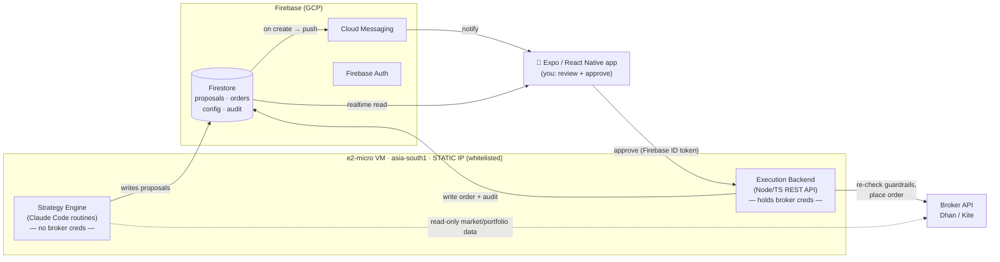

# Portfolio Manager

A **human-in-the-loop** portfolio automation system for Indian markets.

Scheduled Claude Code routines analyse the market and your portfolio and **propose**
orders. Proposals are pushed to a mobile app. **You** review each one and tap to
approve. Only then does a static-IP backend place the order with your broker
(Dhan first, Kite next — broker-agnostic by design).

> **Core safety property:** the part that *thinks* (the Claude routine) can never
> *execute*. It has no broker credentials and no network path to any order API.
> The only thing that can place an order is a backend that requires a fresh,
> human-approved instruction. See [docs/07-security-compliance.md](docs/07-security-compliance.md).

---

## Why it's built this way

| Constraint | Consequence in the design |
|---|---|
| Claude must never place trades on its own | Strategy engine is **write-only to a proposal queue**; zero broker creds; sandboxed egress |
| Every trade needs an explicit human "go" | Execution requires a per-proposal approval from the app, biometric-gated |
| SEBI mandates a **static IP** for API order placement (since 1 Apr 2026) | A single **e2-micro VM in `asia-south1`** with a reserved static IP is the *only* thing that calls broker order APIs; its IP is whitelisted with the broker |
| Must support **Dhan and Kite**, start with Dhan | A `BrokerAdapter` interface with per-broker implementations; broker chosen by config at runtime |
| Everything else already lives on GCP/Firebase | Firestore = data + proposal inbox, FCM = push, Firebase Auth = app login, Secret Manager = broker creds |

---

## Architecture at a glance



Notice the two arrows into `BROKER`: the strategy engine touches **only read-only
data endpoints**; the execution backend is the **only** thing that touches order
endpoints, and it sits behind the whitelisted static IP.

---

## Component map → specs

| Component | What it is | Spec |
|---|---|---|
| **Architecture** | System overview, data flow, trust boundaries, sequence diagrams | [docs/01-architecture.md](docs/01-architecture.md) |
| **Broker abstraction** | `BrokerAdapter` interface, Dhan + Kite adapters, switching, token lifecycle | [docs/02-broker-abstraction.md](docs/02-broker-abstraction.md) |
| **Data model** | Firestore collections, schemas, security rules | [docs/03-data-model.md](docs/03-data-model.md) |
| **Execution backend** | The static-IP service: REST contract, guardrails, idempotency | [docs/04-execution-backend.md](docs/04-execution-backend.md) |
| **Strategy engine** | Scheduled Claude routines that produce proposals | [docs/05-strategy-engine.md](docs/05-strategy-engine.md) |
| **Mobile app** | Expo/RN app: screens, auth, approval UX, notifications | [docs/06-mobile-app.md](docs/06-mobile-app.md) |
| **Security & compliance** | Threat model, guardrails, secrets, audit, SEBI, kill switch | [docs/07-security-compliance.md](docs/07-security-compliance.md) |
| **Infrastructure** | GCP project, VM, static IP, deploy, monitoring | [docs/08-infrastructure.md](docs/08-infrastructure.md) |
| **Roadmap** | Phased delivery plan + open questions | [docs/09-roadmap.md](docs/09-roadmap.md) |
| **Multi-strategy** | Running scalping/day/swing/long-term together: books, ledger, coordinator, risk manager | [docs/10-multi-strategy.md](docs/10-multi-strategy.md) |

---

## Running cost (steady state)

| Item | Cost |
|---|---|
| e2-micro VM (asia-south1) | ~$7–8/month |
| Reserved static IP | free while attached to a running VM |
| Firestore / Auth / FCM / Secret Manager | ~free at single-user volume |
| Dhan order API | free |
| Dhan market-data API | free if 25+ trades/30d, else ₹499/month |
| **Total** | **~₹600–₹1,300/month** (near-zero if active trader) |

---

## Status

🧱 **All modules implemented and unit-tested; nothing has touched a live broker or a
real GCP project yet.** The next step is Phase 0/1 of [docs/09-roadmap.md](docs/09-roadmap.md):
bootstrap the project from [infra/README.md](infra/README.md), then work through the
[VERIFY-LIVE checklist](docs/11-verify-live.md) — the wire-level assumptions each module
made against documented (not live) API shapes.

| Package | What it is | Tests |
|---|---|---|
| `packages/core` | pure spine: domain types, zod schemas, broker interfaces (read/write split), guardrails + code ceilings, proposal state machine, books / ledger / coordinator / risk manager | 408 |
| `packages/broker-dhan` | DhanHQ v2 adapter behind an injectable HTTP client | 198 |
| `packages/broker-kite` | Kite Connect v3 adapter | 192 |
| `apps/backend` | the static-IP execution service (Fastify): the only process that can place an order | 348+ |
| `apps/strategy` | proposals-only strategy engine, six deterministic strategies across long-term / swing / day-trade; order capability banned by lint + a policy test | 252 |
| `apps/mobile` | Expo / React Native review-and-approve app | 388+ |
| `functions/` | Cloud Functions: pushes, proposal expiry, reminders; plus `firestore.rules` / indexes | 60 |
| `infra/` | Terraform (validated), VM bootstrap, systemd, Caddy, strategy egress firewall, deploy scripts, CI | — |

Every package enforces coverage thresholds (core ≥90% lines; apps ≥85%; mobile ≥80%)
and **no unit test touches a network, a broker, Firestore or a wall clock**.

### Developer quick start

```bash
pnpm install
pnpm typecheck && pnpm test && pnpm lint && pnpm build
```

Conventions (binding for contributors and agents): [docs/00-dev-conventions.md](docs/00-dev-conventions.md).
Per-package details: each package's `README.md` / `src/index.ts` header.

## Open decisions

Tracked at the bottom of [docs/09-roadmap.md](docs/09-roadmap.md#open-questions) —
the scalping model is decided (deferred → fast intraday momentum, human-approved);
the rest are defaults you can change before go-live.
