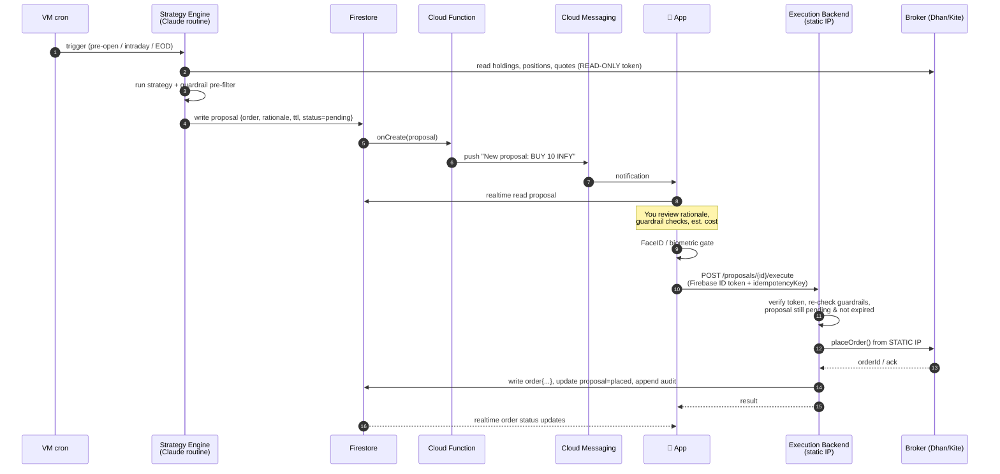
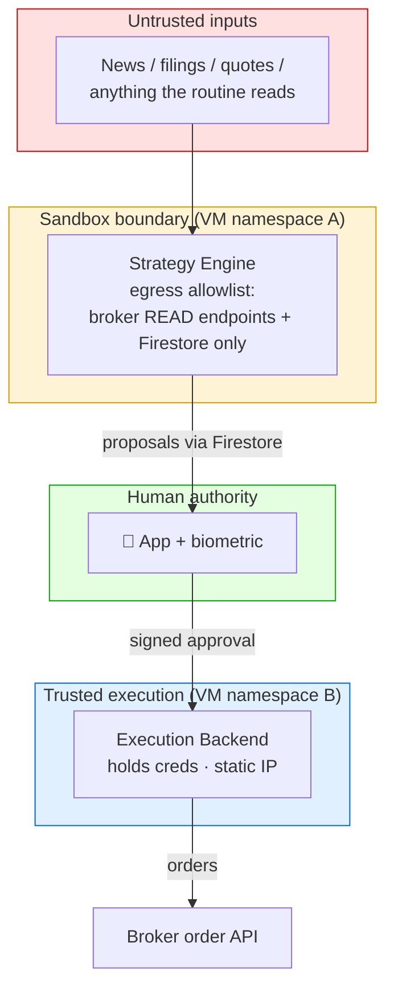

# 01 · Architecture

## 1.1 Goals

1. **Automate the analysis, keep the human on the trigger.** Claude routines do the
   watching, the math, and the "here's what I'd do" — a person approves every order.
2. **Make "Claude places a rogue trade" structurally impossible**, not just
   policy-forbidden. Achieved by separating the *thinking* process from the
   *executing* process at the credential and network level.
3. **Broker-agnostic.** Dhan and Kite behind one interface; switch by config.
4. **SEBI-compliant** static-IP order placement.
5. **Cheap and simple to operate** — one small VM + Firebase.

## 1.2 Non-goals (for v1)

- No fully-autonomous trading (no "auto-approve").
- No HFT / low-latency execution. This is a slow, deliberate, minutes-to-days system.
- No multi-tenant SaaS. Single user (optionally immediate family later — SEBI permits).
- No advisory/recommendation service to third parties.

## 1.3 The four processes and their privileges

The whole security model rests on **who holds what**. Two processes run on the VM,
plus the app and Firebase.

| Process | Runs where | Broker read data? | Broker **order** creds? | Can place orders? | Writes to Firestore |
|---|---|---|---|---|---|
| **Strategy engine** (Claude routines) | VM (sandboxed) | ✅ read-only token | ❌ **never** | ❌ **no network path** | proposals only |
| **Execution backend** | VM (static IP) | ✅ | ✅ (from Secret Manager) | ✅ (only on human approval) | orders, audit, session |
| **Mobile app** | your phone | via cached Firestore | ❌ | ❌ (asks backend) | approval intents only |
| **Firebase** (Firestore/FCM/Auth/Functions) | GCP managed | — | — | ❌ | — |

Key invariant: **the process that can be influenced by untrusted input (the Claude
routine reading news, quotes, filings) is exactly the process that cannot execute.**
A prompt-injection in a news article the routine reads can, at worst, produce a bad
*proposal* — which a human sees and rejects, and which guardrails independently block.

## 1.4 End-to-end data flow



## 1.5 Trust boundaries



Three boundaries an attacker would have to cross to place an unauthorised order:

1. Sandbox → they'd need to break out of the routine's egress allowlist (it can't
   reach an order endpoint even if it "wants" to).
2. Human → they'd need your phone + biometric to approve.
3. Backend guardrails → they'd need the order to pass caps, allowlists, price
   collars, funds, TTL, and IP checks that run **independently** of what was proposed.

## 1.6 Why a VM (not Cloud Run / Functions)

Cloud Run and Cloud Functions have **dynamic, pooled egress IPs** — a broker would
reject their order calls under the static-IP mandate. Forcing serverless egress
through Cloud NAT works but costs more (~$30+/mo for the gateway) and adds moving
parts. A single **e2-micro with a reserved static external IP** is cheaper (~$7–8/mo,
IP free while attached), simpler to whitelist, and lower-latency to the exchange.
Details: [08-infrastructure.md](08-infrastructure.md).

Firebase-managed pieces (Firestore, FCM, Auth, a proposal→push Cloud Function) keep
their normal serverless model — **they never call broker order APIs**, so their
dynamic IPs are irrelevant.

## 1.7 Technology choices

| Layer | Choice | Rationale |
|---|---|---|
| Backend + adapters | **TypeScript (Node 20+)** | Share domain types + `BrokerAdapter` + zod schemas with the app; single language across app/backend |
| Strategy engine | **Claude Code routines** (+ TS/Python helpers) | User's explicit ask; deterministic strategies in TS, optional Claude reasoning; both emit the same proposal schema |
| Mobile app | **Expo / React Native (TS)** | User's existing stack (Firebase + RNFB already in use) |
| Data / messaging / auth | **Firestore, FCM, Firebase Auth** | Already on GCP; realtime listeners fit the proposal-inbox model |
| Secrets | **GCP Secret Manager** | Broker key/secret + daily tokens; never in Firestore or the app |
| Repo | **pnpm/turbo monorepo** | `packages/core` (types+adapters) shared by `apps/backend`, `apps/mobile`, `apps/strategy` |

Proposed repo layout:

```
stock-portfolio-manager/
├── docs/                       # this spec
├── packages/
│   ├── core/                   # domain types, BrokerAdapter iface, zod schemas, guardrail lib
│   ├── broker-dhan/            # Dhan adapter
│   └── broker-kite/            # Kite adapter
├── apps/
│   ├── backend/                # execution backend (REST, runs on VM, static IP)
│   ├── strategy/               # Claude routines + deterministic strategies (VM cron)
│   └── mobile/                 # Expo app
├── functions/                  # Firebase Cloud Functions (proposal→FCM)
└── infra/                      # Terraform / deploy scripts
```

## 1.8 Environments

| Env | Broker | Purpose |
|---|---|---|
| **dry-run** | none (simulated fills) | develop strategies + UX without touching real money; `placeOrder` is stubbed |
| **paper** | broker sandbox if available | end-to-end with fake orders |
| **prod** | Dhan (then Kite) | real orders, real static IP |

`dry-run` mode is a **first-class feature**, not an afterthought — the execution
path is identical except the adapter's `placeOrder` returns a simulated ack. This
lets the entire approve→execute flow be tested safely. See
[04-execution-backend.md](04-execution-backend.md) and [09-roadmap.md](09-roadmap.md).
