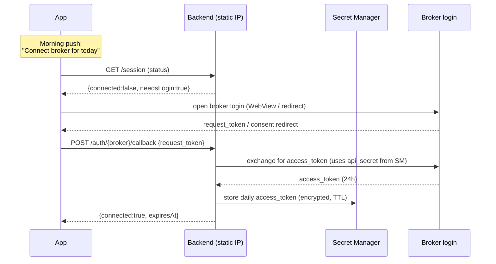

# 02 · Broker Abstraction

The requirement: **support Dhan and Kite, switch between them, start with Dhan.**
This is met by a single `BrokerAdapter` interface over broker-neutral domain types.
Everything upstream (strategy, backend, app) speaks the neutral model; each adapter
translates to/from its broker's wire format.

## 2.1 Design principles

- **Neutral domain model is the contract.** No Dhan/Kite field names leak past the
  adapter boundary.
- **Read and write are separable.** The interface is split so the strategy engine can
  be handed a **read-only** adapter (no order methods, no order creds) while the
  backend gets the full one. This is enforced at the *type* and *credential* level.
- **Instruments are canonical.** A `CanonicalSymbol` (exchange + segment + trading
  symbol) is resolved to a broker-specific instrument id inside the adapter via a
  cached instrument master.
- **Idempotent orders.** Every `placeOrder` carries a caller-generated
  `idempotencyKey`; adapters attach it to the broker's order tag where supported so
  retries never double-fire.
- **Fail safe.** Any adapter uncertainty (expired token, unknown symbol, ambiguous
  status) throws a typed error; callers treat "unknown" as "did not place".

## 2.2 Neutral domain types

```ts
// packages/core/src/domain.ts

export type Broker = 'dhan' | 'kite';
export type Exchange = 'NSE' | 'BSE' | 'MCX';
export type Segment = 'EQ' | 'FNO' | 'CURRENCY' | 'COMMODITY';

export interface CanonicalSymbol {
  exchange: Exchange;
  segment: Segment;
  tradingSymbol: string;        // e.g. "RELIANCE", "NIFTY24DEC22000CE"
}

/** Opaque, broker-specific instrument handle produced by resolveInstrument(). */
export interface InstrumentRef {
  broker: Broker;
  canonical: CanonicalSymbol;
  brokerInstrumentId: string;   // Dhan securityId | Kite instrument_token
  exchangeSegmentCode: string;  // Dhan "NSE_EQ" | Kite "NSE"
  lotSize: number;
  tickSize: number;
  instrumentType?: string;      // broker instrument class some endpoints need (Dhan charts: EQUITY/OPTIDX…)
  expiryCode?: number;          // Dhan derivative expiry code for charts
}

export type Side = 'BUY' | 'SELL';
export type OrderType = 'MARKET' | 'LIMIT' | 'SL' | 'SL-M';
export type Product = 'DELIVERY' | 'INTRADAY' | 'MARGIN' | 'MTF';  // neutral names
export type Validity = 'DAY' | 'IOC';

export interface NormalizedOrder {
  symbol: CanonicalSymbol;
  side: Side;
  quantity: number;             // in units (adapter validates against lotSize)
  orderType: OrderType;
  product: Product;
  validity: Validity;
  limitPrice?: number;          // required for LIMIT / SL
  triggerPrice?: number;        // required for SL / SL-M
  disclosedQuantity?: number;
}

export interface OrderAck {
  brokerOrderId: string;
  status: OrderStatusCode;      // usually 'SUBMITTED' at ack time
  raw: unknown;                 // broker response, for audit
}

export type OrderStatusCode =
  | 'SUBMITTED' | 'OPEN' | 'PARTIAL' | 'COMPLETE'
  | 'CANCELLED' | 'REJECTED' | 'EXPIRED' | 'UNKNOWN';

export interface OrderStatus {
  brokerOrderId: string;
  status: OrderStatusCode;
  filledQty: number;
  pendingQty: number;
  avgPrice?: number;
  rejectionReason?: string;
  updatedAt: string;            // ISO
  raw: unknown;
}

export interface Holding {
  symbol: CanonicalSymbol;
  quantity: number;
  avgCostPrice: number;
  lastPrice: number;
  pnl: number;
  raw: unknown;
}

export interface Position {
  symbol: CanonicalSymbol;
  netQty: number;
  product: Product;
  avgPrice: number;
  lastPrice: number;
  realizedPnl: number;
  unrealizedPnl: number;
  raw: unknown;
}

export interface Funds {
  availableCash: number;
  usedMargin: number;
  availableMargin: number;
  raw: unknown;
}

export interface Quote {
  symbol: CanonicalSymbol;
  ltp: number;
  open: number; high: number; low: number; close: number;
  volume: number;
  ts: string;
}

export interface Candle {
  ts: string; open: number; high: number; low: number; close: number; volume: number;
}

export interface HistoricalRequest {
  symbol: CanonicalSymbol;
  interval: '1m' | '5m' | '15m' | '1h' | '1d';
  from: string; to: string;     // ISO
}

export interface SessionStatus {
  broker: Broker;
  connected: boolean;
  expiresAt?: string;           // ISO; broker token expiry
  staticIpOk?: boolean;         // last order-API call not IP-rejected
}
```

## 2.3 The interface (split read / write)

```ts
// packages/core/src/broker.ts

/** Read-only surface — safe to hand to the strategy engine. */
export interface BrokerReadAdapter {
  readonly broker: Broker;
  getSessionStatus(): Promise<SessionStatus>;

  // portfolio
  getHoldings(): Promise<Holding[]>;
  getPositions(): Promise<Position[]>;
  getFunds(): Promise<Funds>;

  // market data
  resolveInstrument(sym: CanonicalSymbol): Promise<InstrumentRef>;
  getQuote(syms: CanonicalSymbol[]): Promise<Quote[]>;
  getHistorical(req: HistoricalRequest): Promise<Candle[]>;
}

/** Full surface — only constructed inside the execution backend. */
export interface BrokerAdapter extends BrokerReadAdapter {
  placeOrder(order: NormalizedOrder, idempotencyKey: string): Promise<OrderAck>;
  modifyOrder(brokerOrderId: string, patch: Partial<NormalizedOrder>): Promise<OrderAck>;
  cancelOrder(brokerOrderId: string): Promise<OrderAck>;
  getOrder(brokerOrderId: string): Promise<OrderStatus>;
  listOrders(): Promise<OrderStatus[]>;
}
```

> **Implementation rule:** every adapter method is `async`. Validation and instrument
> resolution happen *inside* the returned promise, so callers only ever see rejections —
> never a synchronous throw that escapes a `.catch()`. (Found the hard way in the Kite
> adapter; both adapters now comply.)

The strategy engine imports **only** `BrokerReadAdapter` and is constructed with a
read-scoped token. It has no `placeOrder` method to call and no order credentials in
its process env. (Type-level + credential-level + network-level enforcement — three
layers.)

## 2.4 Factory & broker switching

Broker selection is **config-driven** and stored per user in Firestore
(`config/{uid}.activeBroker`), overridable per environment.

```ts
// packages/core/src/factory.ts
export interface BrokerCreds {
  broker: Broker;
  // resolved from Secret Manager at runtime; shapes differ per broker.
  // expiresAt = ISO expiry of the daily access token, stored alongside it (§2.8);
  // without it the adapter cannot observe true expiry and fails closed.
  dhan?: { clientId: string; accessToken: string; expiresAt?: string };
  kite?: { apiKey: string; accessToken: string; expiresAt?: string };
}

export function createReadAdapter(creds: BrokerCreds): BrokerReadAdapter { /* ... */ }
export function createAdapter(creds: BrokerCreds): BrokerAdapter { /* backend only */ }
```

Switching Dhan ↔ Kite is: (1) ensure the target broker has a valid daily session,
(2) set `config.activeBroker`. All proposals thereafter target the active broker;
in-flight proposals for the previous broker are honoured or expired by TTL. The app
surfaces a broker switcher (see [06-mobile-app.md](06-mobile-app.md)).

## 2.5 Enum mapping tables

The adapter is where neutral enums become broker codes. These tables are the
implementation checklist.

### Product

| Neutral | Dhan `productType` | Kite `product` |
|---|---|---|
| DELIVERY | `CNC` | `CNC` |
| INTRADAY | `INTRADAY` | `MIS` |
| MARGIN | `MARGIN` | `NRML` |
| MTF | `MTF` | *(n/a — reject)* |

### Order type

| Neutral | Dhan `orderType` | Kite `order_type` |
|---|---|---|
| MARKET | `MARKET` | `MARKET` |
| LIMIT | `LIMIT` | `LIMIT` |
| SL | `STOP_LOSS` | `SL` |
| SL-M | `STOP_LOSS_MARKET` | `SL-M` |

### Exchange segment

| Neutral (exchange, segment) | Dhan `exchangeSegment` | Kite `exchange` |
|---|---|---|
| NSE, EQ | `NSE_EQ` | `NSE` |
| BSE, EQ | `BSE_EQ` | `BSE` |
| NSE, FNO | `NSE_FNO` | `NFO` |
| MCX, COMMODITY | `MCX_COMM` | `MCX` |

### Validity

| Neutral | Dhan | Kite |
|---|---|---|
| DAY | `DAY` | `DAY` |
| IOC | `IOC` | `IOC` |

## 2.6 Dhan adapter (v1 — first implementation)

- **Base URL:** `https://api.dhan.co/v2`
- **Auth headers:** `access-token: <JWT>`, `dhanClientId: <clientId>` (order &
  portfolio endpoints), `Content-Type: application/json`
- **Token lifecycle:** API **key+secret give a 1-year credential**; from it you mint a
  **daily access token valid 24h** (SEBI-aligned). Renew via `POST /v2/RenewToken`.
  → daily re-auth flow, see §2.8.
- **Static IP:** required specifically for **order** APIs (place/modify/cancel,
  incl. super/forever orders). Dhan exposes a "Setup Static IP" API to register the
  VM's IP. Read/data endpoints are not IP-gated.

| Adapter method | Dhan endpoint |
|---|---|
| `placeOrder` | `POST /v2/orders` |
| `modifyOrder` | `PUT /v2/orders/{orderId}` |
| `cancelOrder` | `DELETE /v2/orders/{orderId}` |
| `getOrder` | `GET /v2/orders/{orderId}` |
| `listOrders` | `GET /v2/orders` |
| `getHoldings` | `GET /v2/holdings` |
| `getPositions` | `GET /v2/positions` |
| `getFunds` | `GET /v2/fundlimit` |
| `getHistorical` | `POST /v2/charts/historical` \| `/charts/intraday` |
| `getQuote` (snapshot) | REST market-quote endpoint |
| live feed (optional) | WS `wss://api-feed.dhan.co` (binary, ≤5000 instruments) |
| instrument master | Dhan **scrip master CSV** → `tradingSymbol → securityId + exchangeSegment` |

Place-order body (built by the adapter from `NormalizedOrder`):

```jsonc
{
  "dhanClientId": "10xxxxxx",
  "transactionType": "BUY",            // side
  "exchangeSegment": "NSE_EQ",         // from mapping
  "productType": "CNC",                // from mapping
  "orderType": "LIMIT",                // from mapping
  "validity": "DAY",
  "securityId": "11536",               // resolved from tradingSymbol
  "quantity": 10,
  "price": 2950.5,                     // limitPrice
  "triggerPrice": 0,
  "disclosedQuantity": 0,
  "correlationId": "<idempotencyKey>"  // Dhan correlation/tag field
}
```

## 2.7 Kite adapter (v1.1 — second implementation)

- **Base URL:** `https://api.kite.trade`
- **Auth headers:** `Authorization: token <api_key>:<access_token>`, `X-Kite-Version: 3`
- **Token lifecycle:** login flow yields a `request_token`; the backend combines it
  with `api_secret` (SHA-256 checksum) via `POST /session/token` to get an
  **access token valid until ~6:00 am next day** → daily re-auth, §2.8.
- **Static IP:** one IP per app whitelisted in the Kite developer console.

| Adapter method | Kite endpoint |
|---|---|
| `placeOrder` | `POST /orders/regular` |
| `modifyOrder` | `PUT /orders/regular/{order_id}` |
| `cancelOrder` | `DELETE /orders/regular/{order_id}` |
| `getOrder` | `GET /orders/{order_id}` |
| `listOrders` | `GET /orders` |
| `getHoldings` | `GET /portfolio/holdings` |
| `getPositions` | `GET /portfolio/positions` |
| `getFunds` | `GET /user/margins` |
| `getHistorical` | `GET /instruments/historical/{token}/{interval}` |
| `getQuote` | `GET /quote` |
| live feed (optional) | WS `wss://ws.kite.trade` |
| instrument master | `GET /instruments` CSV → `tradingsymbol → instrument_token` |

Place-order form body (Kite uses form-encoding):

```
tradingsymbol=RELIANCE&exchange=NSE&transaction_type=BUY&order_type=LIMIT
&quantity=10&product=CNC&price=2950.5&validity=DAY&tag=<idempotencyKey(≤20 chars)>
```

> Note: Kite `tag` is capped (~20 chars) — the adapter stores a short hash of the
> idempotency key as the tag and the full key in Firestore.

## 2.8 Daily re-authentication (both brokers)

Both brokers expire the trading token roughly daily. This is **by design a good
thing** here: it guarantees a human authenticates each trading day.



- The **app never sees `api_secret` or the access token** — it only carries the
  short-lived `request_token`/consent to the backend, which does the exchange and
  stores the token in Secret Manager.
- If no valid token exists at execution time, the backend **refuses** and the app
  prompts re-login. (Fail safe.)
- Optional convenience: Dhan's key+secret module can mint the daily token with a
  credential/TOTP verification; whether to automate this vs. always requiring the
  human login is an [open question](09-roadmap.md#open-questions) (leaning: keep the
  human login for the daily "presence" guarantee).

## 2.9 Instrument master & caching

- Each adapter downloads its broker's instrument dump (Dhan scrip master CSV / Kite
  `/instruments` CSV) **once per day**, caches it (VM disk + Firestore mirror), and
  builds `tradingSymbol → InstrumentRef`.
- `resolveInstrument` is the single choke point translating a `CanonicalSymbol` into
  a broker id, lot size, and tick size — used for validation (quantity multiple of
  lot size, price multiple of tick size) before any order is built.

## 2.10 Error taxonomy (typed)

```ts
export type BrokerErrorKind =
  | 'AUTH_EXPIRED'        // token invalid/expired → refuse, prompt re-login
  | 'IP_NOT_WHITELISTED'  // static-IP rejection → alert, do not retry blindly
  | 'INSUFFICIENT_FUNDS'
  | 'INSTRUMENT_UNKNOWN'
  | 'RATE_LIMITED'
  | 'RISK_REJECTED'       // broker-side RMS rejection
  | 'NETWORK'
  | 'UNKNOWN';
export class BrokerError extends Error { kind: BrokerErrorKind; raw?: unknown; }
```

`AUTH_EXPIRED` and `IP_NOT_WHITELISTED` are **never** silently retried — they surface
to the app and the audit log immediately.
