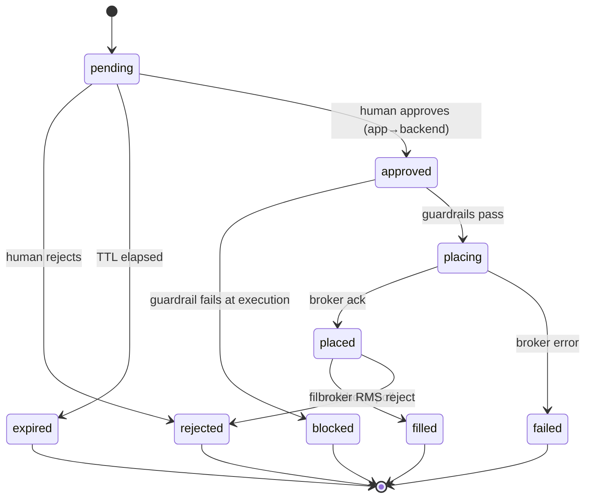

# 03 · Data Model (Firestore)

Firestore plays three roles:

1. **Proposal inbox** — the strategy engine writes here; the app listens in realtime.
2. **Read model** — cached portfolio/orders for a fast app UI.
3. **Audit ledger** — append-only record of everything that happened.

**No secrets ever live in Firestore.** Broker api-key/secret and daily access tokens
live only in Secret Manager on the VM. Firestore holds only *non-secret* session
metadata (connected?, expiry).

All schemas are defined once as **zod** in `packages/core/src/schemas.ts` and reused
by backend (validation), strategy (writing), and app (typing).

## 3.1 Collection map

```
users/{uid}                                  # profile + prefs
config/{uid}                                 # active broker, guardrails, kill switch
brokerSessions/{uid}/brokers/{broker}        # non-secret session status
proposals/{proposalId}                       # strategy → app inbox
orders/{orderId}                             # execution records (backend-owned)
portfolio/{uid}/holdings/{symbolKey}         # cached read model
portfolio/{uid}/positions/{symbolKey}        # cached read model
portfolio/{uid}/funds/current                # cached read model
auditLog/{eventId}                           # append-only ledger
idempotency/{idempotencyKey}                 # execution de-dupe guard
strategies/{uid}/defs/{strategyId}           # strategy configs/params
books/{uid}/books/{bookId}                   # capital sleeves (see 10)
ledger/{uid}/entries/{entryId}               # per-book position attribution (see 10)
mandates/{uid}/mandates/{mandateId}          # bounded auto-exec sessions (see 10, opt-in)
```

> **Multi-strategy note:** running several horizons together adds the `books`, `ledger`,
> and `mandates` collections and extends `proposals`/`orders`/`config` with `bookId` +
> `horizon`. Those schemas live in [10-multi-strategy.md](10-multi-strategy.md) §10.8 to
> keep the orchestration model in one place.

## 3.2 `config/{uid}` — the control panel

```ts
export const Config = z.object({
  uid: z.string(),
  activeBroker: z.enum(['dhan', 'kite']),
  environment: z.enum(['dry-run', 'paper', 'prod']),

  killSwitch: z.boolean(),                    // true ⇒ backend refuses ALL orders
  tradingEnabled: z.boolean(),                // master on/off for the strategy engine

  guardrails: z.object({
    maxOrderValueInr: z.number(),             // per single order notional
    maxDailyNotionalInr: z.number(),          // sum across a day
    maxOrdersPerDay: z.number(),
    allowedSegments: z.array(z.enum(['EQ','FNO','CURRENCY','COMMODITY'])),
    allowedProducts: z.array(z.enum(['DELIVERY','INTRADAY','MARGIN','MTF'])),
    symbolAllowlist: z.array(z.string()).nullable(),  // null ⇒ no allowlist filter
    symbolBlocklist: z.array(z.string()),
    priceCollarPct: z.number(),               // limit price must be within ±% of LTP
    proposalTtlSeconds: z.number(),           // default proposal validity window
    requireBiometric: z.boolean(),
  }),

  updatedAt: z.string(),
});
```

`config` is the single source of truth for guardrails; the **backend enforces it at
execution time** and the strategy engine reads it to pre-filter. The app can edit it
(subject to rules) but **cannot** relax a hard ceiling below is defined in code (the
backend clamps to code-level absolute maxima regardless of config — belt and braces).

## 3.3 `proposals/{proposalId}` — the heart of the system

```ts
export const Proposal = z.object({
  id: z.string(),
  uid: z.string(),
  createdAt: z.string(),
  createdBy: z.literal('strategy-engine'),
  strategyId: z.string(),                     // which routine produced it
  targetBroker: z.enum(['dhan', 'kite']),

  status: z.enum([
    'pending',      // awaiting human decision
    'approved',     // human tapped approve; backend about to place
    'placing',      // backend is calling broker
    'placed',       // order accepted by broker
    'filled',       // fully executed
    'rejected',     // human rejected
    'expired',      // TTL elapsed with no decision
    'failed',       // placement failed (see failureReason)
    'blocked',      // guardrail blocked at execution
  ]),

  order: NormalizedOrderSchema,               // the neutral order (see 02)

  rationale: z.object({
    summary: z.string(),                      // human-readable "why"
    signals: z.record(z.any()),               // indicators/values used
    confidence: z.enum(['low','medium','high']).optional(),
  }),

  marketContext: z.object({
    ltpAtProposal: z.number(),
    estimatedValueInr: z.number(),
    estimatedCharges: z.number().optional(),  // brokerage+taxes estimate
    capturedAt: z.string(),
  }),

  guardrailPrecheck: z.object({               // what the engine checked before writing
    passed: z.boolean(),
    checks: z.array(z.object({ name: z.string(), ok: z.boolean(), detail: z.string() })),
  }),

  ttlExpiresAt: z.string(),                    // hard expiry; app hides + backend refuses after

  // decision + execution trail (filled in later)
  decidedBy: z.string().optional(),           // uid of approver
  decidedAt: z.string().optional(),
  orderId: z.string().optional(),             // → orders/{orderId}
  failureReason: z.string().optional(),
});
```

**Lifecycle state machine:**



Only the **backend** may transition a proposal past `approved`. The app may only move
`pending → approved` or `pending → rejected` (and even that goes *through* the backend
in v1 — see [04](04-execution-backend.md) §4.4; direct client writes are restricted by
rules in §3.9).

## 3.4 `orders/{orderId}` — execution records (backend-owned)

```ts
export const OrderRecord = z.object({
  id: z.string(),
  uid: z.string(),
  proposalId: z.string(),
  broker: z.enum(['dhan', 'kite']),
  brokerOrderId: z.string().nullable(),
  idempotencyKey: z.string(),

  order: NormalizedOrderSchema,
  status: z.enum(['SUBMITTED','OPEN','PARTIAL','COMPLETE','CANCELLED','REJECTED','EXPIRED','UNKNOWN']),
  filledQty: z.number(),
  avgFillPrice: z.number().nullable(),
  rejectionReason: z.string().nullable(),

  approvedBy: z.string(),                      // uid
  approvedAt: z.string(),
  submittedAt: z.string().nullable(),
  ipUsed: z.string(),                          // static IP the order left from (audit)
  environment: z.enum(['dry-run','paper','prod']),

  brokerRawAck: z.any(),                       // raw broker response
  updatedAt: z.string(),
});
```

Clients (the app) have **read-only** access to `orders`. Only the backend writes them.

## 3.5 `brokerSessions/{uid}/brokers/{broker}` — non-secret session status

```ts
export const BrokerSession = z.object({
  broker: z.enum(['dhan', 'kite']),
  connected: z.boolean(),
  expiresAt: z.string().nullable(),           // token expiry (metadata only!)
  staticIpOk: z.boolean(),                     // last order call not IP-rejected
  lastConnectedAt: z.string().nullable(),
  // NB: NO token, NO secret here — those live in Secret Manager
});
```

## 3.6 `portfolio/{uid}/...` — cached read model

Written by the backend (and/or a scheduled refresh) so the app renders instantly and
the strategy engine can read a consistent snapshot without hammering the broker.

```ts
export const HoldingDoc = HoldingSchema.extend({ symbolKey: z.string(), updatedAt: z.string() });
export const PositionDoc = PositionSchema.extend({ symbolKey: z.string(), updatedAt: z.string() });
export const FundsDoc = FundsSchema.extend({ updatedAt: z.string() });
```

`symbolKey` = `${exchange}:${segment}:${tradingSymbol}` (stable doc id).

## 3.7 `auditLog/{eventId}` — append-only ledger

Every meaningful event, immutable (rules deny update/delete; see §3.9).

```ts
export const AuditEvent = z.object({
  id: z.string(),
  uid: z.string(),
  ts: z.string(),
  actor: z.enum(['strategy-engine','backend','app-user','system']),
  type: z.enum([
    'proposal.created','proposal.approved','proposal.rejected','proposal.expired',
    'order.submitted','order.filled','order.rejected','order.failed',
    'guardrail.blocked','killswitch.toggled','config.changed',
    'session.connected','session.expired','ip.changed','auth.login',
  ]),
  refId: z.string().optional(),               // proposalId / orderId
  detail: z.record(z.any()),
  ip: z.string().optional(),
});
```

## 3.8 `idempotency/{idempotencyKey}` — execution de-dupe

Doc id = the idempotency key. The backend creates it **transactionally** before
placing an order; a second attempt with the same key finds the doc and returns the
prior result instead of re-placing.

```ts
export const IdempotencyRecord = z.object({
  key: z.string(),
  proposalId: z.string(),
  orderId: z.string().nullable(),
  status: z.enum(['in-progress','done','failed']),
  createdAt: z.string(),
  result: z.any().nullable(),
});
```

## 3.9 Security rules (sketch)

```
rules_version = '2';
service cloud.firestore {
  match /databases/{db}/documents {

    function isOwner(uid) { return request.auth != null && request.auth.uid == uid; }

    // App reads its own data; writes are tightly constrained.
    match /config/{uid} {
      allow read: if isOwner(uid);
      // app may edit guardrails/killswitch but NOT environment or activeBroker
      allow update: if isOwner(uid)
        && request.resource.data.environment == resource.data.environment;
      allow create, delete: if false;         // backend/admin only
    }

    match /proposals/{id} {
      allow read: if isOwner(resource.data.uid);
      // App cannot create proposals (only the strategy engine via Admin SDK can).
      allow create: if false;
      // App may ONLY reject a still-pending proposal; approvals go through backend REST.
      allow update: if isOwner(resource.data.uid)
        && resource.data.status == 'pending'
        && request.resource.data.status == 'rejected'
        && request.resource.data.order == resource.data.order;   // can't mutate the order
      allow delete: if false;
    }

    match /orders/{id} {
      allow read: if isOwner(resource.data.uid);
      allow write: if false;                   // backend (Admin SDK) only
    }

    match /portfolio/{uid}/{doc=**} {
      allow read: if isOwner(uid);
      allow write: if false;                   // backend only
    }

    match /brokerSessions/{uid}/{doc=**} {
      allow read: if isOwner(uid);
      allow write: if false;                   // backend only
    }

    match /auditLog/{id} {
      allow read: if isOwner(resource.data.uid);
      allow create, update, delete: if false;  // backend only; never mutated
    }

    match /idempotency/{key} { allow read, write: if false; }   // backend only
    match /strategies/{uid}/{doc=**} { allow read: if isOwner(uid); allow write: if false; }
  }
}
```

Rationale highlights:
- The **strategy engine and backend use the Firebase Admin SDK** (service account) and
  bypass these rules — so `allow ... : if false` for clients still lets those trusted
  processes write. The rules exist to constrain the **app/client**.
- The app can *reject* a pending proposal directly (cheap, safe, reversible-nothing)
  but **approval/execution always routes through the backend REST** so guardrails,
  idempotency, IP, and credential handling happen server-side.
- `auditLog`, `orders`, `idempotency` are never client-writable → tamper-evident.

## 3.10 Indexes & TTL

- Composite index: `proposals` on `(uid, status, ttlExpiresAt)` for the inbox query.
- Firestore **TTL policy** on `proposals.ttlExpiresAt` and `idempotency.createdAt`
  (e.g. 7-day) to auto-clean, though a scheduled function flips `pending→expired`
  first so the app reflects expiry before deletion.
