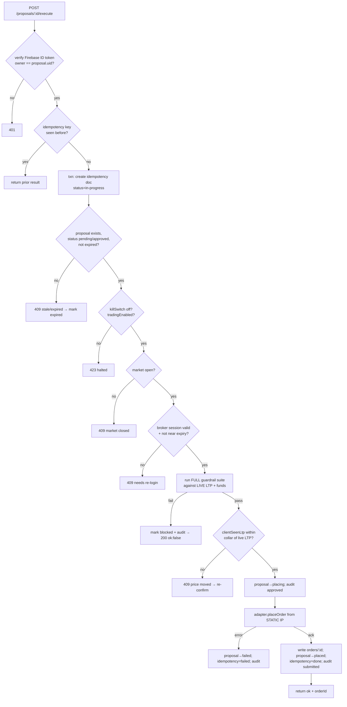

# 04 · Execution Backend

The **only** component that can place an order. Runs on the e2-micro VM behind the
whitelisted static IP. Node 20 + TypeScript (Fastify/Express), Firebase Admin SDK,
Secret Manager client, the full `BrokerAdapter`.

Its entire job: **turn a human-approved proposal into a broker order, safely, exactly
once, from the static IP — or refuse.**

## 4.1 Responsibilities

- Verify the caller (Firebase ID token) is the account owner.
- Own the broker credentials (from Secret Manager) and the daily token exchange.
- Enforce guardrails **independently** of the strategy engine's pre-check.
- Guarantee **exactly-once** execution via idempotency keys.
- Place/modify/cancel orders through the active broker adapter.
- Write `orders`, update `proposals`, append `auditLog` (Admin SDK).
- Refresh the cached portfolio read model.
- Be the source of truth for `killSwitch`, session status, and IP health.

## 4.2 What it must NEVER do

- Never place an order without a matching `pending`/`approved`, non-expired proposal.
- Never place an order the guardrails reject — config *or* code-level absolute caps.
- Never expose broker secrets to the app or logs.
- Never auto-approve. There is no code path from "proposal" to "placed" that doesn't
  pass through an authenticated human approval call.

## 4.3 REST API (v1)

All endpoints except `/health` and `/auth/dhan/redirect` require `Authorization: Bearer
<Firebase ID token>` (verified via Admin SDK). Responses are JSON. Base path `/v1`.

| Method | Path | Purpose |
|---|---|---|
| `GET` | `/health` | liveness/readiness (no auth) |
| `GET` | `/session` | per-broker session status (connected, expiry, ipOk) |
| `POST` | `/auth/:broker/login-url` | get broker login URL for daily re-auth |
| `POST` | `/auth/:broker/callback` | exchange request_token/consent → store daily token |
| `GET` | `/auth/dhan/redirect` | **no auth** — Dhan's login page sends the browser here with `?tokenId=`; the backend consumes the consent, stores the token, then 302s to the app's `pm://broker-callback?broker=dhan&status=ok\|error` |
| `GET` | `/portfolio/holdings` \| `/positions` \| `/funds` | proxied/cached reads |
| `POST` | `/proposals/:id/execute` | **approve + place** (the critical path) |
| `POST` | `/proposals/:id/reject` | reject a proposal |
| `POST` | `/orders/:id/cancel` | cancel an open order |
| `GET` | `/orders/:id` | fetch live order status (re-syncs from broker) |
| `POST` | `/config/killswitch` | toggle global halt |
| `POST` | `/admin/whitelist-ip` | (broker permitting) push VM IP to broker |

### The critical path: `POST /v1/proposals/:id/execute`

Request:
```jsonc
{
  "idempotencyKey": "uuid-v4-generated-by-app",
  "clientSeenLtp": 2951.0,        // LTP the user saw when approving (staleness guard)
  "biometricAssertion": "..."      // optional attestation that biometric passed
}
```

Response (success):
```jsonc
{
  "ok": true,
  "orderId": "ord_abc",
  "brokerOrderId": "112111182198",
  "status": "SUBMITTED"
}
```

Response (blocked):
```jsonc
{
  "ok": false,
  "reason": "GUARDRAIL_BLOCKED",
  "failedChecks": [{ "name": "maxOrderValueInr", "detail": "₹120000 > cap ₹100000" }]
}
```

## 4.4 Execution algorithm (exactly-once, guardrailed)



Notes:
- **Idempotency** is transactional: the `create` of `idempotency/{key}` is the lock. A
  duplicate tap (double-fire, retry, network glitch) can never place twice.
- **Live re-check**: guardrails run against *live* LTP and funds at execution time, not
  the values captured when the proposal was written — a proposal that looked fine at
  9:15 but is now out-of-collar is blocked.
- **Staleness guard**: if the price moved beyond the collar since the user looked, the
  backend returns `409 price moved` and the app asks the user to re-confirm at the new
  price rather than silently filling a worse trade.

## 4.5 Guardrail suite

Two enforcement points, same library (`packages/core/src/guardrails.ts`):
- **Strategy engine** runs it as a pre-filter (don't bother the human with impossible
  proposals).
- **Backend** runs it authoritatively at execution against live data.

| Guardrail | Rule | Source |
|---|---|---|
| Kill switch | `config.killSwitch === false` | config |
| Trading enabled | `config.tradingEnabled === true` | config |
| Market hours | now ∈ exchange session (with pre-open handling) | code + calendar |
| Session valid | broker token present, not expired, `staticIpOk` | session |
| Proposal fresh | `now < ttlExpiresAt` and status ∈ {pending,approved} | proposal |
| Max order value | `qty × price ≤ maxOrderValueInr` | config + **code ceiling** |
| Daily notional | running day sum + this ≤ `maxDailyNotionalInr` | config + audit sum |
| Daily order count | day count < `maxOrdersPerDay` | config + audit count |
| Segment allowed | `segment ∈ allowedSegments` | config |
| Product allowed | `product ∈ allowedProducts` | config |
| Symbol allow/block | in allowlist (if set) and not in blocklist | config |
| Price collar | limit within `±priceCollarPct` of live LTP | config + live quote |
| Tick/lot validity | price % tickSize == 0; qty % lotSize == 0 | instrument master |
| Funds sufficient | required margin ≤ availableMargin | live funds |
| Idempotency | key unused | idempotency store |

**Code-level absolute ceilings** (constants, not user-editable) clamp the config so a
compromised/mis-set config can't authorise an unbounded order. Example:
`ABS_MAX_ORDER_VALUE_INR = 500_000`. Config caps must be ≤ these.

## 4.6 Daily token exchange (backend-owned)

- Holds `api_key`/`api_secret` (Dhan) or `api_key`/`api_secret` (Kite) in Secret
  Manager. Never sent to the app.
- `/auth/:broker/callback` receives the short-lived `request_token`/consent from the
  app, performs the broker exchange, writes the resulting daily access token to Secret
  Manager (with TTL metadata), and updates `brokerSessions`.
- A pre-execution check refuses if the token is expired or within a small margin of
  expiry (avoids a token dying mid-order).

## 4.7 Order status reconciliation

`placeOrder` returns an ack (usually `SUBMITTED`), not a fill. Fills arrive later.
- **Poll**: a lightweight loop polls `getOrder`/`listOrders` for open orders and
  updates `orders` + `proposals` (`placed → filled/rejected`) + audit.
- **Postback/webhook**: if the broker supports order postbacks to a URL, register the
  backend's static-IP endpoint (`POST /v1/broker/:broker/postback`) for push updates;
  poll remains the fallback.

## 4.8 dry-run / paper mode

The backend reads `config.environment`:
- `dry-run`: `adapter.placeOrder` is swapped for a **simulator** that returns a
  synthetic ack and simulates a fill at live LTP after a delay. Everything else —
  guardrails, idempotency, audit, Firestore writes, app UX — is identical. This is how
  the entire approve→execute flow is tested before real money.
- `paper`: uses the broker sandbox if available.
- `prod`: real adapter, real static IP.

The environment is **backend-controlled and not app-editable** (rules in
[03](03-data-model.md) §3.9) so you can't accidentally flip to prod from the phone.

## 4.9 Security posture

- **AuthN**: Firebase ID token verified per request (Admin SDK). Optionally bind to an
  allowlist of `uid`s (single user / family).
- **AuthZ**: every mutating call re-checks `owner == resource.uid`.
- **Transport**: HTTPS only (caddy/nginx + Let's Encrypt, or GCP L7 LB). HSTS.
- **Rate limiting**: per-uid token bucket; hard cap aligned with broker OPS limits
  (SEBI personal-use guidance ≈ ≤10 orders/sec — we're far below by design).
- **Secrets**: only from Secret Manager at boot/refresh; never logged. Structured logs
  redact order-cred fields.
- **Audit**: every execute/reject/cancel/killswitch/login writes an immutable
  `auditLog` event with actor, ip, and refId.
- **Least privilege**: the VM service account has `secretmanager.secretAccessor` for
  exactly the broker secrets and Firestore access; nothing else.

## 4.10 Failure & recovery

| Failure | Behaviour |
|---|---|
| Backend down | app shows "execution unavailable"; no orders possible (fail-closed); proposals still visible |
| Token expired mid-day | execute refused → app prompts re-login |
| Static IP rejected | `IP_NOT_WHITELISTED` surfaced + audited; halts order attempts; alerts you |
| Broker API 5xx/timeout | typed `NETWORK` error; **no blind retry** of place (could double-fire) — status reconciled via `getOrder` using idempotency correlation before any retry |
| Duplicate approval | idempotency returns prior result |
| Partial fill | tracked in `orders.filledQty`; proposal stays `placed` until terminal |
