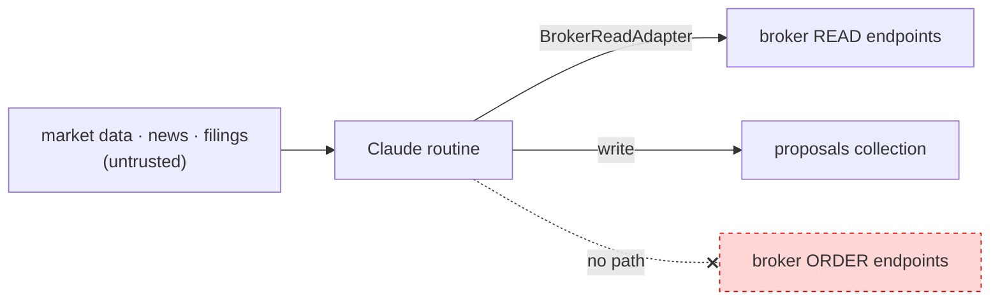
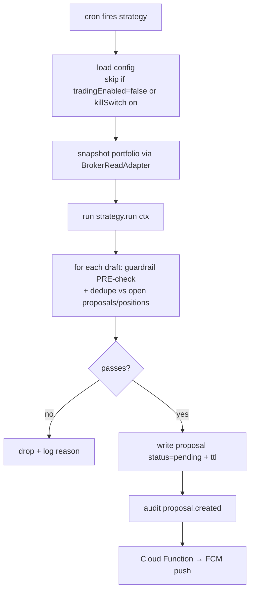

# 05 · Strategy Engine (Claude routines)

Scheduled routines that read the market + your portfolio and **write proposals**. This
is where "Claude Code routines push orders to the app" lives — except they push
*proposals*, never orders, and they are structurally incapable of doing more.

## 5.1 The hard boundary (re-stated, because it's the whole point)

The strategy engine process:
- is constructed with a **`BrokerReadAdapter` only** — no `placeOrder` method exists in
  its imports;
- has **no broker order credentials** in its environment;
- runs under a **network egress allowlist** permitting only broker *read/data*
  endpoints + Firestore + Secret Manager (read-scoped) — it literally cannot open a
  socket to an order endpoint;
- writes to **`proposals` only** (its Firebase service account is scoped to that).

Therefore the worst a compromised/prompt-injected routine can do is **write a bad
proposal**, which (a) a human sees and rejects and (b) the backend's independent
guardrails block. It cannot move money. This is the property that makes it safe to let
an LLM reason over untrusted inputs (news, filings, forums).



> **Running many strategies together:** each strategy belongs to a **book** (capital
> sleeve) and its drafts pass through a **coordinator** + **portfolio risk manager**
> before becoming proposals — this is what lets scalping/day/swing/long-term coexist
> without fighting over capital or trading against each other. See
> [10-multi-strategy.md](10-multi-strategy.md). The isolation property below holds for
> every strategy in every book, and the LLM path never gains execution rights even
> inside an auto-exec mandate.

## 5.2 Two kinds of proposal producers

Both emit the identical `Proposal` schema and both pass through the shared guardrail
pre-filter. They can coexist.

1. **Deterministic strategies (code).** Plain TS functions — rebalancing, stop-loss
   monitors, DCA schedulers, signal rules. Predictable, testable, backtestable. These
   are the backbone.
2. **Claude-reasoned proposals (LLM).** A Claude Code routine that reviews the
   portfolio + context and suggests discretionary actions with a written rationale.
   Useful for "here's what I'd consider and why," always human-gated.

> Recommendation: build the **deterministic** path first (Phase 2), add the
> **Claude-reasoned** path once the pipeline + guardrails are proven (Phase 5). The
> LLM path never gets more privilege than the deterministic one.

## 5.3 Strategy interface

```ts
// apps/strategy/src/types.ts
export interface StrategyContext {
  uid: string;
  config: Config;                        // guardrails, active broker, env
  read: BrokerReadAdapter;               // READ-ONLY broker access
  portfolio: { holdings: Holding[]; positions: Position[]; funds: Funds };
  now: Date;
  logger: Logger;
}

export interface StrategyResult {
  proposals: ProposalDraft[];            // 0..n candidate orders
  notes?: string;
}

export interface Strategy {
  id: string;
  schedule: CronExpr | 'pre-open' | 'intraday' | 'eod';
  run(ctx: StrategyContext): Promise<StrategyResult>;
}
```

A `ProposalDraft` is a `NormalizedOrder` + `rationale` + `marketContext`; the harness
attaches `ttlExpiresAt`, runs the guardrail pre-filter, and writes surviving drafts to
Firestore.

## 5.4 Execution harness (per scheduled tick)



- **Dedupe**: never write a proposal that duplicates an already-`pending` proposal or
  an intent already reflected in positions (e.g. don't propose the same stop-loss
  twice). Keyed by `(strategyId, symbol, side, intent)`.
- **Idempotent scheduling**: a routine that runs every 5 min re-evaluating a stop-loss
  produces *at most one* live proposal for that intent at a time.

## 5.5 Scheduling

Cron on the VM (systemd timers or a small scheduler). Typical cadence:

| Tick | When (IST) | Example strategies |
|---|---|---|
| pre-open | 09:00 | overnight-gap review, rebalance drift check, "connect broker" reminder |
| intraday | every 5–15 min, 09:15–15:30 | stop-loss / target monitors, signal entries |
| eod | 15:45 | booking, next-day planning, DCA scheduling |

All ticks are **no-ops** when `tradingEnabled=false`, `killSwitch=true`, or no broker
session — the engine never queues proposals you can't act on.

> **Implementation note:** price-taking strategies (DCA, rebalance, entries) actually
> run on **intraday** ticks. A proposal drafted at 09:00 or 15:45 IST can never pass the
> `marketHours` guardrail and would expire unusable; the pre-open tick is for reviews and
> reminders, the eod tick for square-off records and next-day planning. `StrategyDef.ticks`
> lets an operator override per strategy. See [11](11-verify-live.md) §11.4.

## 5.6 Example strategies (v1 candidates)

| Strategy | Trigger | Proposal |
|---|---|---|
| **Stop-loss monitor** | holding's LTP ≤ user-set stop | SELL to exit (SL-M) |
| **Target booking** | LTP ≥ target | SELL to book |
| **Rebalance drift** | allocation drifts > band from target weights | BUY/SELL to rebalance |
| **DCA / SIP** | schedule (e.g. weekly) | BUY fixed ₹ of chosen instruments |
| **Cash deployment** | idle cash > threshold | BUY per plan |

Each is a `Strategy` module; parameters live in `strategies/{uid}/defs/{strategyId}`
and are editable from the app's settings.

## 5.7 The Claude-reasoned routine (Phase 5)

- Implemented as a **Claude Code scheduled routine** on the VM with a **restricted
  toolset**: read-only market/portfolio tools + a single `writeProposal` tool that
  validates against the zod schema and the guardrail pre-filter before writing.
- **No shell, no order tool, no secret access** beyond the read token. The
  `writeProposal` tool is the *only* side effect it can cause.
- Its rationale text is surfaced verbatim in the app so you see the "why" and can judge
  it. Confidence is advisory only; guardrails and your approval are unchanged.
- Treated as **untrusted output**: the backend re-validates everything at execution
  exactly as for deterministic proposals.

## 5.8 Backtesting (Phase 5)

Deterministic strategies implement a pure decision function over a `StrategyContext`,
so the same code runs against historical candles (`getHistorical`) in a backtest
harness. Outputs simulated proposals + a fills model → performance report. This lets
you validate a strategy before it's ever allowed to write live proposals.

## 5.9 What the engine deliberately does *not* do

- Does not place, modify, or cancel orders.
- Does not hold or read order credentials.
- Does not decide `environment` or `activeBroker` (reads them from config).
- Does not bypass guardrails (its pre-filter is a courtesy; the backend is the law).
