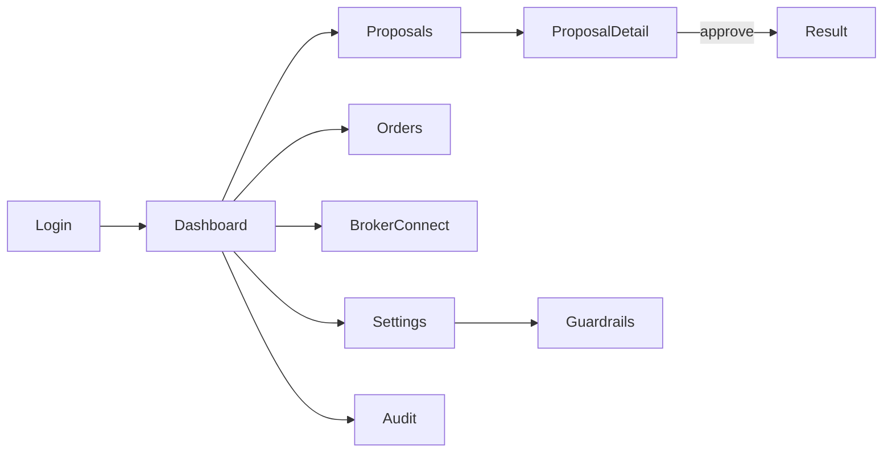

# 06 · Mobile App (Expo / React Native)

Your control surface. It's where you **see** proposals, **review** the "why," and
**approve** the irreversible step. Built on your existing stack: Expo + React Native +
Firebase (Auth, Firestore, FCM via RNFB).

## 6.1 Principles

- **The app is the human in "human-in-the-loop."** Approving must feel deliberate, not
  accidental — biometric + a confirm gesture, never a bare button on a list.
- **The app never holds broker credentials.** It carries a Firebase ID token to the
  backend and, briefly, a broker `request_token` during daily login. Nothing else.
- **Realtime, glanceable.** Firestore listeners drive live proposal/order state; FCM
  brings you in when something needs you.
- **Fail visible.** Session expired, kill switch on, backend down, price moved — all
  shown plainly; the app never hides why an action can't happen.

## 6.2 Tech

| Concern | Choice |
|---|---|
| Framework | Expo (SDK 55+), React Native, TypeScript |
| Auth | Firebase Auth (Google + Apple), per `rn-firebase-auth-drive` pattern |
| Data | Firestore realtime listeners (`@react-native-firebase/firestore` or JS SDK) |
| Push | FCM via `@react-native-firebase/messaging` |
| Secure storage | `expo-secure-store` (only for local prefs/tokens, never broker creds) |
| Biometric | `expo-local-authentication` (FaceID/TouchID/device credential) |
| Backend calls | HTTPS + `Authorization: Bearer <Firebase ID token>` |
| Types | shared from `packages/core` (same zod schemas as backend) |

## 6.3 Screens



### 1. Dashboard
- Portfolio value, day P&L, holdings summary (from cached `portfolio/*`).
- **Active broker** chip (Dhan/Kite) + session status ("Connected · expires 6:00 am"
  or "Tap to connect for today").
- **Kill switch** toggle (prominent, confirms on enable/disable).
- Pending-proposals badge.

### 2. Proposals (inbox)
- List of `pending` proposals with: symbol, side, qty, order type, est. value, a
  one-line rationale, and a **live TTL countdown**.
- Swipe or tap → detail. Quick **Reject** available inline; **Approve** only from
  detail (deliberate friction).

### 3. Proposal detail — the approval screen
- Full order: side, qty, order type, product, limit/trigger price, validity.
- **Rationale** (from the strategy / Claude routine) — the "why."
- **Market context**: LTP now (live), LTP at proposal, drift, estimated charges,
  estimated net value.
- **Guardrail checklist**: each check with ✓/✗ (all must be ✓ to enable approve).
- **Live price collar indicator**: if price has moved outside collar, approve is
  disabled with "price moved — refresh."
- **Approve** = biometric prompt → confirm slider → `POST /proposals/:id/execute` with
  a fresh `idempotencyKey` + `clientSeenLtp`.
- States: pending → (approving spinner) → placed → filled, or blocked/failed with a
  clear reason.

### 4. Orders / Activity
- History of `orders` with status, fills, avg price, timestamps.
- Open orders can be **Cancelled** (→ backend `POST /orders/:id/cancel`).

### 5. Broker Connect
- Per-broker daily login (WebView/redirect → `request_token` → backend callback).
- **Switch active broker** (Dhan ↔ Kite): requires the target broker to have a valid
  session; sets `config.activeBroker` (via backend).
- Shows static-IP health (`staticIpOk`) and last connected time.

### 6. Settings → Guardrails
- Edit `config.guardrails`: max order value, daily notional, max orders/day, allowed
  segments/products, symbol allow/blocklist, price collar %, proposal TTL, require
  biometric.
- **Cannot** change `environment` or lift caps above code ceilings (backend/rules
  reject). Changes audited.
- Strategy on/off + parameters (`strategies/{uid}/defs`).
- Notification preferences.

### 7. Audit
- Read-only feed of `auditLog` (proposals, approvals, orders, blocks, logins, IP
  changes) — your tamper-evident history.

## 6.4 Approval flow (detail)

```mermaid
sequenceDiagram
    participant U as You
    participant App
    participant BE as Backend
    U->>App: open proposal
    App->>App: subscribe live LTP; compute collar
    U->>App: tap Approve
    App->>App: biometric (FaceID)
    App->>App: confirm slider
    App->>BE: POST /proposals/:id/execute {idempotencyKey, clientSeenLtp}
    alt price moved / guardrail
        BE-->>App: 409 / ok:false + reason
        App->>U: show reason, offer refresh & retry
    else success
        BE-->>App: ok + orderId
        App->>U: "Order placed" → live status via Firestore
    end
```

## 6.5 Notifications (FCM)

| Event | Push | Deep link |
|---|---|---|
| New proposal | "BUY 10 INFY proposed — review" | proposal detail |
| Proposal expiring soon | "Proposal expires in 2 min" | proposal detail |
| Order filled | "SELL 5 TCS filled @ ₹3,910" | order detail |
| Order rejected/failed | "Order rejected: insufficient funds" | order detail |
| Session needed | "Connect your broker for today" | broker connect |
| Guardrail blocked | "Auto-blocked: over daily cap" | audit |
| Kill switch on | "Trading halted" | dashboard |

Tapping a notification deep-links to the relevant screen. Proposal pushes respect the
TTL — an expired proposal opens read-only.

## 6.6 Offline / degraded states

- **No backend**: proposals still visible (Firestore cache); approve disabled with
  "execution unavailable."
- **No session**: approve disabled; prompt to connect broker.
- **Stale data**: LTP age shown; approve gated on a fresh quote.
- **Kill switch on**: global banner; all approvals disabled.

## 6.7 Security in the app

- Biometric gate before every execute (config-driven, default on).
- ID token refreshed via Firebase SDK; never persisted in plaintext.
- No broker secret ever touches the app; broker login happens in a WebView and only
  the short-lived `request_token` is forwarded to the backend.
- Jailbreak/root check (best-effort) before enabling prod execution.
- Certificate pinning to the backend domain (optional, Phase 3+).
