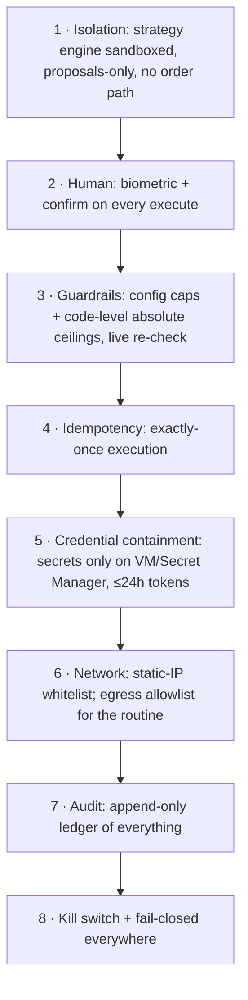

# 07 · Security & Compliance

This system touches real money, runs an LLM over untrusted inputs, and is regulated.
Security isn't a layer — it's the reason the architecture is shaped the way it is.

## 7.1 The central guarantee

> **The process that can be manipulated cannot execute; the process that can execute
> cannot be reached by manipulation without a human.**

- The **strategy engine** reads untrusted data (news, quotes, filings) and reasons over
  it — but has no order creds and no network path to order APIs. Max blast radius: a
  bad *proposal*.
- The **execution backend** can place orders — but only on a fresh, authenticated,
  human-approved instruction, and only if independent guardrails pass.

An attacker must defeat **all three** to place a rogue order: the sandbox, your phone +
biometric, and the backend guardrails.

## 7.2 Threat model

| Threat | Vector | Mitigation |
|---|---|---|
| **Prompt injection** into a routine | malicious text in news/filing/forum the routine reads | routine can only write proposals; no order path; human review; backend guardrails; rationale shown for scrutiny |
| **Compromised strategy code/dependency** | supply chain | least-privilege service account (proposals-only); no order creds in process; egress allowlist; still human-gated |
| **Stolen Firebase ID token / phone** | device theft | biometric gate per execute; token short-lived; kill switch; daily broker session expiry; per-order & daily caps bound loss |
| **Stolen broker token** | Secret Manager/VM breach | token valid ≤24h; **static-IP whitelist** means it's useless off the VM's IP; secrets never in app/Firestore/logs |
| **Backend compromise** | RCE on VM | code-level absolute caps clamp any config; audit log is append-only (Admin-only, no update/delete); alerts on anomalies; kill switch; funds bounded by broker limits |
| **Double execution** | double-tap, ret, network | transactional idempotency key; broker correlation id |
| **Stale/mispriced order** | price moved since proposal | live-LTP re-check + price collar + client-seen-LTP staleness guard |
| **Config tampering from app** | malicious/mistaken client write | rules forbid client editing `environment`/`activeBroker`/caps-above-ceiling; backend re-validates |
| **Man-in-the-middle** | network | HTTPS+HSTS; optional cert pinning; Firebase Admin token verification |
| **Insider mistake** (you) | fat-finger approve | biometric + confirm slider + guardrails + caps + dry-run default |

## 7.3 Defense in depth (layers)

## 7.4 Secrets management

| Secret | Where | Who reads it |
|---|---|---|
| Broker api-key / api-secret | GCP Secret Manager | backend only |
| Daily broker access token | Secret Manager (TTL) | backend only |
| Read-scoped data token (if separate) | Secret Manager | strategy engine (read) + backend |
| Firebase service account (Admin) | Secret Manager / VM metadata | backend, strategy (scoped) |
| FCM keys | Firebase config | Cloud Function |

Rules: never in Firestore, never in the app, never in logs, never in git. Rotation:
broker key annually (Dhan 1-yr), tokens daily (automatic), service accounts as needed.
VM service account granted only `secretmanager.secretAccessor` on the specific secrets.

## 7.5 Guardrails as the last line

Detailed in [04](04-execution-backend.md) §4.5. Two properties worth restating:
- **Independent** of the proposal — computed from live data + config + audit history,
  not trusted from what the strategy wrote.
- **Code ceilings** clamp config, so even a bad/compromised config can't authorise an
  unbounded order (`ABS_MAX_ORDER_VALUE_INR`, `ABS_MAX_DAILY_NOTIONAL_INR`,
  `ABS_MAX_ORDERS_PER_DAY`).

## 7.6 SEBI / regulatory compliance (as of 2026)

| Requirement | How we meet it |
|---|---|
| **Static IP** for API order placement (from 1 Apr 2026) | all order calls originate from the e2-micro VM's reserved static IP, whitelisted with the broker; only the backend calls order APIs |
| Personal-use algo (self-coded logic at client end) permitted | single-user (optionally immediate family — spouse/dependent children/dependent parents, as SEBI allows); not offered to third parties |
| Daily token expiry / session management | broker tokens ≤24h; daily human re-auth |
| Order-rate limits (personal use ≲10 OPS) | rate limiter far below; this is a slow system by design |
| Broker registers/monitors API usage | we use official broker APIs with our whitelisted IP under our account |
| No unregistered investment advice to others | system is personal; provides data + user's own strategy execution, not third-party advice |

> ⚠️ This is an engineering summary, not legal advice. Broker- and SEBI-specific
> operational details (exact IP-registration mechanics, OPS ceilings, any registration
> for self-use algos) must be confirmed against current broker docs at build time and
> are tracked in [09-roadmap.md](09-roadmap.md#open-questions).

## 7.7 Audit & observability

- **Audit ledger** (`auditLog`): append-only, client-unwritable, covers proposal
  lifecycle, approvals, orders, guardrail blocks, kill-switch, logins, IP changes.
- **Logs**: structured, secret-redacted, shipped to Cloud Logging.
- **Alerts** (Cloud Monitoring): backend down, `IP_NOT_WHITELISTED`, repeated
  `AUTH_EXPIRED`, guardrail-block spikes, daily-cap approached, order failures.
- **Reconciliation**: daily EOD job compares our `orders` vs broker's order/trade book;
  discrepancies alert.

## 7.8 Kill switch & incident response

- **Kill switch**: `config.killSwitch=true` → backend refuses all orders immediately;
  strategy engine stops proposing. Toggle from the app (biometric) or by editing config
  server-side. Fail-closed: if the backend can't read config, it refuses.
- **Incident playbook** (documented in `infra/` at build): (1) hit kill switch, (2)
  revoke broker token / rotate secret, (3) remove IP from whitelist if needed, (4)
  review audit log, (5) reconcile with broker, (6) post-mortem.

## 7.9 Privacy

- Data is single-user and stays in your GCP project.
- No portfolio data sent to third parties. If the Claude-reasoned routine (Phase 5)
  sends context to an LLM API, that is explicit, logged, and limited to the minimum
  needed; it can be disabled and is off by default.
- No PII in URLs/query strings; HTTPS everywhere.
