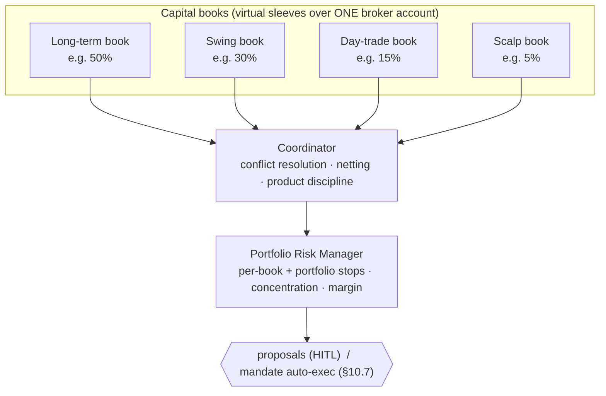

# 10 · Multi-Strategy Orchestration

Running **scalping, day-trading, swing, and long-term together** turns this from "a
strategy" into an actual *portfolio manager*: several strategies with different time
horizons, each with its own capital, positions, and risk budget, coordinated so they
don't fight each other or the broker account they share.

This document adds the concepts that make that safe: **books (capital sleeves)**,
**position attribution**, a **coordinator**, a **portfolio risk manager**, and an
honest treatment of the **scalping ⟷ human-in-the-loop conflict**.

---

## 10.1 The four horizons

| Horizon | Hold time | Product | Typical orders | Order cadence | Fits human approval? | Edge/risk note |
|---|---|---|---|---|---|---|
| **Long-term** | months–years | CNC (delivery) | LIMIT/MARKET buys, rare sells, SIP/DCA | days–weekly | ✅ perfect | lowest cost, highest capacity |
| **Swing** | days–weeks | CNC / NRML / MTF | LIMIT entries, SL, targets | daily + intraday checks | ✅ perfect | good risk/reward, moderate turnover |
| **Day trading** | minutes–hours | MIS (intraday) | LIMIT / SL-M, square-off by EOD | intraday, minutes | ⚠️ workable (tap within seconds) | higher cost/turnover, needs discipline |
| **Scalping** | seconds–minutes | MIS (intraday) | MARKET / tight LIMIT, ticks | seconds, many/min | ❌ **cannot wait for a tap** | highest cost, thinnest edge, latency-sensitive — see §10.7 |

The first three fit the approve-each-order model cleanly. **Scalping does not** — a
biometric tap per order is impossible at scalping speed. §10.7 is the honest treatment
and your decision point.

---

## 10.2 The orchestration model



- Each **strategy** belongs to a **book**. A book is a *virtual* capital sleeve over
  your single real broker account.
- The **coordinator** reconciles what all books want to do before anything reaches you
  or the market — preventing self-trades, enforcing product discipline, netting.
- The **risk manager** applies portfolio-wide limits on top of per-book limits.

---

## 10.3 Books = capital sleeves (the key idea)

You have **one** broker account with one pool of cash/margin. To let four strategies
coexist without fighting over money, we layer a **virtual accounting** on top: each
book gets a budget, and a strategy may only propose within its book's *available*
budget.

```ts
export const Book = z.object({
  id: z.enum(['long_term', 'swing', 'day_trade', 'scalp']),
  label: z.string(),
  enabled: z.boolean(),
  allocationPct: z.number(),            // share of total managed capital
  allocatedCapitalInr: z.number(),      // derived = totalCapital * allocationPct
  deployedInr: z.number(),              // sum of open-position cost in this book (ledger)
  realizedPnlInr: z.number(),           // book's booked P&L (day / lifetime)
  product: z.enum(['DELIVERY','INTRADAY','MARGIN','MTF']),  // fixed per book
  risk: z.object({
    maxPositions: z.number(),
    maxPositionValueInr: z.number(),
    dailyLossStopInr: z.number(),       // book pauses if breached
    perTradeRiskPct: z.number(),        // position sizing input
  }),
});
```

Rules:
- **Σ allocationPct ≤ 100%.** A reserve (e.g. 10%) is sensible.
- A book's proposals are rejected if they'd push `deployedInr` beyond
  `allocatedCapitalInr` — *virtual* budget check, **in addition to** the backend's real
  funds/margin guardrail. Both must pass.
- `deployedInr` and `realizedPnlInr` come from the **position ledger** (§10.4), not the
  broker's commingled view.

This is what makes them "work together" instead of "compete": the scalp book physically
cannot spend the long-term book's capital.

---

## 10.4 Position attribution ledger

The broker reports **net** positions per `(symbol, product)`. That's not enough when
two books trade the same symbol with the same product (e.g. day-trade *and* scalp both
MIS on NIFTY). So we keep our **own ledger**, tagging every order/fill to a book, and
reconstruct per-book positions from it.

```ts
export const LedgerEntry = z.object({
  id: z.string(),
  uid: z.string(),
  bookId: z.string(),
  strategyId: z.string(),
  symbolKey: z.string(),            // exchange:segment:tradingSymbol
  product: z.enum(['DELIVERY','INTRADAY','MARGIN','MTF']),
  side: z.enum(['BUY','SELL']),
  qty: z.number(),
  price: z.number(),
  orderId: z.string(),              // → orders/{id}
  ts: z.string(),
});
// Per-book position = signed sum of ledger entries for (bookId, symbolKey).
```

- **Exit rule:** a book may only propose to close quantity **it owns** in the ledger.
  The scalp book can't sell the long-term book's delivery shares.
- **Reconciliation:** an EOD job sums the ledger by `(symbol, product)` and asserts it
  matches the broker's net position; any mismatch alerts (drift = bug or manual trade
  outside the system).
- **Manual trades** you place yourself in the broker app are detected by reconciliation
  and attributed to an `unmanaged` book so the numbers stay honest.

---

## 10.5 The coordinator (prevents strategies fighting)

Before proposals reach you (or the mandate executor), the coordinator runs across the
*combined* set from all books:

| Rule | What it does |
|---|---|
| **Product discipline** | every order carries its book's product; an exit must match the entry's product. A day-trade (MIS) order can **never** touch a delivery (CNC) holding. |
| **Self-trade / wash prevention** | if two books would send *opposing* orders on the same symbol within a short window (one BUY, one SELL), it blocks/defers the pair and flags it — you don't pay spread+charges to trade against yourself. |
| **Netting (optional)** | if two books want the *same* side on the same symbol, optionally net into fewer orders (config; off by default to keep book attribution clean). |
| **Precedence** | on genuine conflict, investment books (long-term > swing) outrank intraday books (day-trade > scalp) for shared constraints; configurable. |
| **Duplicate suppression** | never surface two live proposals for the same intent (carried over from [05](05-strategy-engine.md)). |
| **Capital arbitration** | if combined proposals exceed real available margin, allocate by book priority and budget; defer the rest. |

The coordinator's decisions are audited (`coordinator.blocked`, `coordinator.netted`,
`coordinator.deferred`) so you can see *why* a strategy's idea didn't become a proposal.

---

## 10.6 Portfolio risk manager

Per-book limits (§10.3) are not enough — correlated books can sink the whole ship (all
four long the same sector on a red day). The risk manager sits above the books:

| Control | Scope | Action on breach |
|---|---|---|
| Portfolio daily-loss stop | sum of all books' realized+unrealized day P&L | **kill switch on** — halt all new orders |
| Per-book daily-loss stop | one book | pause that book for the day |
| Gross exposure cap | Σ |position value| across books | block new exposure |
| Concentration cap | per symbol / per sector across books | block adds to the concentrated name |
| Margin headroom | real broker margin vs. combined intraday needs | throttle intraday books first |
| Intraday square-off guard | MIS books near session close | propose/force square-off before auto-square-off charges |

These extend the guardrail suite in [04](04-execution-backend.md) §4.5 and run at both
the coordinator (pre-filter) and the backend (authoritative, live data).

---

## 10.7 The scalping problem — and your decision

**Honest framing:** true scalping (enter/exit in seconds, tens of trades an hour, edge
measured in ticks) is fundamentally incompatible with "a human taps approve on each
order." It's also, for a retail account over a REST/WebSocket API, the **least likely
to be profitable** of the four — you're paying full brokerage + STT + slippage and
racing participants with colocation and far lower latency, and SEBI/broker per-second
order caps constrain you further.

> ✅ **DECISION (recorded):** we go **C → A**. Scalping is **deferred**; we ship
> long-term + swing + day-trade first, then add scalping as **Option A (fast intraday
> momentum, human-in-the-loop)**. The **Option B mandate is not planned** and would only
> be revisited on explicit opt-in with a proven backtested edge. The three options are
> kept below for the design record.

So scalping forces a choice. Three options:

### Option A — Reframe as "fast intraday momentum" (recommended default)
Keep **human-in-the-loop**. The "scalp" book becomes a fast **intraday momentum** book:
holds minutes (not seconds), tolerates a few-second approval tap, fewer/larger trades.
You keep the safety model unchanged; you lose true tick-scalping (which was unlikely to
pay anyway).

### Option B — Bounded auto-execute *sessions* (mandate model)
You explicitly activate a **scalp session** with hard rails, biometric-confirmed:
```
instrument(s): [NIFTYFUT]      time window: 60 min (auto-expires)
max capital: ₹X                max trades: N        per-trade size: Y
daily loss stop: ₹Z            entry/exit: DETERMINISTIC rules only (no LLM)
```
Within that window, **deterministic** code auto-fires entries/exits per your rules and
stops the instant any bound is hit or you hit the kill switch. Every fill is audited and
pushed to you live.

> **Boundaries I hold on Option B, non-negotiable:**
> 1. **No LLM in the auto-fire path.** Claude/Claude-reasoned routines can *never* place
>    orders. Only deterministic, human-authored rules run inside a mandate. (The whole
>    [strategy-engine](05-strategy-engine.md) isolation still holds — Claude writes
>    proposals, never executes.)
> 2. **Per-session human activation.** A mandate is a *bounded, expiring* authorization
>    you switch on while present — never a standing "always auto-trade" mode.
> 3. **Hard rails + kill switch + code-level ceilings** apply exactly as in
>    [07](07-security-compliance.md); a mandate can only *narrow* limits, never widen.
>
> This is the one place per-order human approval is relaxed. I'll build it, but only
> under those constraints and as an explicit opt-in — it is the highest-risk component
> and gets the strongest guardrails and the last phase.

### Option C — Defer scalping
Ship **long-term + swing + day-trade** now (all clean HITL). Revisit scalping later once
the pipeline, ledger, coordinator, and risk manager are battle-tested.

**My recommendation:** **C now, then A** — build the three horizons that fit the safe
model, treat the fourth as fast-intraday-momentum under HITL, and only consider the
Option-B mandate if you have a *proven, backtested, deterministic* scalp edge worth the
risk. We can design Option B's interfaces now so nothing blocks it later.

---

## 10.8 Data-model additions

Extends [03-data-model.md](03-data-model.md):

```
books/{uid}/books/{bookId}                 # capital sleeves + per-book risk (§10.3)
ledger/{uid}/entries/{entryId}             # position attribution (§10.4)
mandates/{uid}/mandates/{mandateId}        # bounded auto-exec sessions (Option B, §10.7)
```

- `proposals/{id}` gains: `bookId`, `strategyId` (already), `horizon`
  (`long_term|swing|day_trade|scalp`), and `coordinator` result block.
- `orders/{id}` gains: `bookId`, `horizon` (so P&L and the ledger attribute correctly).
- `config/{uid}` gains: `totalManagedCapitalInr`, `reservePct`, and per-book toggles;
  book definitions live in `books/*`.

```ts
export const Mandate = z.object({           // Option B only
  id: z.string(), uid: z.string(), bookId: z.literal('scalp'),
  instruments: z.array(z.string()),
  activatedAt: z.string(), expiresAt: z.string(),      // hard TTL
  maxCapitalInr: z.number(), maxTrades: z.number(),
  perTradeSizeInr: z.number(), dailyLossStopInr: z.number(),
  ruleSetId: z.string(),                    // DETERMINISTIC rule set (no LLM)
  status: z.enum(['active','expired','stopped','exhausted']),
  tradesPlaced: z.number(), realizedPnlInr: z.number(),
  activatedBy: z.string(),                  // uid + biometric assertion
});
```

Mandates are backend-owned, biometric-gated to create, and auto-expire. The strategy
engine can *suggest* activating a mandate (a proposal-like nudge), but only **you**
activate one.

---

## 10.9 How multi-strategy stays safe

Everything from [07](07-security-compliance.md) still holds, plus:
- **Books cap blast radius**: a runaway strategy can lose at most its book's budget /
  daily-loss stop, not the whole account.
- **Ledger + reconciliation** make cross-strategy interference detectable and prevent a
  book from touching another book's positions.
- **Coordinator** stops self-trades and enforces product discipline.
- **Portfolio risk manager** adds an account-wide loss stop that trips the kill switch.
- **LLM stays out of execution** in every mode, including mandates.
- **HITL is the default**; auto-exec exists only as a bounded, human-activated, LLM-free
  mandate you opt into.

---

## 10.10 Phasing impact

Weaves into [09-roadmap.md](09-roadmap.md):
- **Phase 1** gains the `books` + `ledger` foundations (read-side attribution).
- **Phase 2** adds the coordinator + risk pre-filter and the **long-term** and **swing**
  strategies (both clean HITL).
- **Phase 3** adds **day-trade** (MIS, EOD square-off) through the same approve path, in
  dry-run first.
- **Phase 5+** adds the **scalp** book as either Option A (fast momentum, HITL) or, only
  on explicit opt-in with a proven deterministic edge, the **Option B mandate** with its
  own hardening and sign-off.

No phase introduces an LLM-driven or unbounded auto-execution path.
